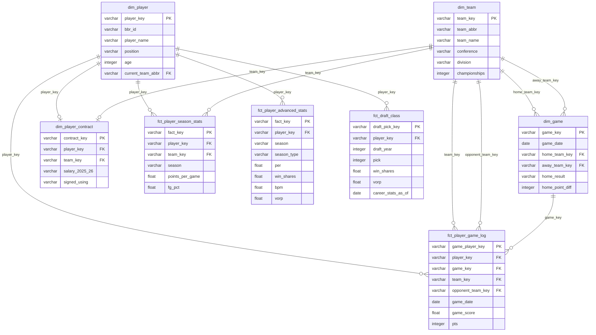

# NBA Analytics — dbt + PostgreSQL Portfolio

End-to-end analytics pipeline that ingests NBA data from [Basketball Reference](https://www.basketball-reference.com), loads it into PostgreSQL, and transforms it into a dimensional model using dbt Core.

---

## Architecture

```
Basketball Reference
        │
        │  Selenium (headless Chromium) — one session reused across pages
        ▼
  src/scraping/          ← Python scripts, one per data domain
        │
        │  pandas → CSV
        ▼
   seeds/ (raw layer)    ← dbt seed loads CSVs into PostgreSQL analytics_raw schema
        │
        ▼
 models/staging/bbr/     ← stg_bbr__*.sql  — type-cast, rename, filter header rows
        │
        ▼
 models/intermediate/    ← int_*.sql        — de-duplicate traded players (TOT/NTM logic)
        │
        ▼
   models/marts/         ← dim_*.sql / fct_*.sql  — dimensional model, materialized as tables
```

### Schema layout in PostgreSQL

| Schema | Purpose |
|---|---|
| `analytics_raw` | Seed CSVs loaded verbatim by `dbt seed` |
| `analytics_staging` | Cleaned, typed views over the raw seeds |
| `analytics_intermediate` | Business-logic views (de-duplication, joins) |
| `analytics_marts` | Final tables consumed by BI tools or notebooks |

---

## Data Sources

All data comes from **Basketball Reference**. Plain HTTP requests return 403; Selenium drives a headless Chromium instance to bypass this.

| Script | BBR page | Output seed | Notes |
|---|---|---|---|
| `src/scraping/players.py` | Per-game roster | `seeds/players.csv` | Adds `season` column |
| `src/scraping/stats.py` | Per-game full stats | `seeds/players_stats.csv` | Adds `season` column |
| `src/scraping/advanced_stats.py` | Advanced stats — regular + playoffs | `seeds/players_advanced_stats.csv` | `season_type` ∈ {regular, playoffs} |
| `src/scraping/teams.py` | All-time franchise summary | `seeds/team.csv` | |
| `src/scraping/contracts.py` | Current player contracts | `seeds/contracts.csv` | |
| `src/scraping/draft.py` | NBA Draft 1986–2025 | `seeds/draft.csv` | Single browser session, ~2 min |
| `src/scraping/player_gamelogs.py` | Game log por jogador — inclui GmSc, adversário, resultado | `seeds/player_gamelogs.csv` | Depende de `players.csv` (bbr_id) |
| `src/scraping/box_scores.py` | Box scores por data (alternativo) | `seeds/box_scores.csv` | Incremental por date range |
| _(static)_ | — | `seeds/team_info.csv` | 30-team reference (conference, division) |

### BBR season variable

`BBR_SEASON` in `.env` controls which season is scraped:

```
BBR_SEASON=2026   → scrapes the 2025-26 season
                    season label stored as "2025-26" in all CSVs
```

---

## dbt Models

### Staging layer (`models/staging/bbr/`)

| Model | Source seed | Description |
|---|---|---|
| `stg_bbr__players` | `players` | Roster: name, team, position, age, season |
| `stg_bbr__player_stats` | `players_stats` | 25 per-game stat columns + season |
| `stg_bbr__player_advanced_stats` | `players_advanced_stats` | PER, TS%, WS, BPM, VORP + season + season_type |
| `stg_bbr__teams` | `team` | Franchise history |
| `stg_bbr__contracts` | `contracts` | Salary data by season |
| `stg_bbr__draft` | `draft` | Draft picks with career stats |
| `stg_bbr__player_gamelogs` | `player_gamelogs` | Game log por jogador — GmSc, adversário, resultado, minutos decimal |
| `stg_bbr__box_scores` | `box_scores` | Per-player per-game box score (alternativo) |

### Intermediate layer (`models/intermediate/`)

| Model | Purpose |
|---|---|
| `int_players__deduped` | Removes per-team rows for traded players (keeps TOT/2TM/3TM aggregate) |
| `int_player_stats__season_totals` | Same de-duplication applied to stats |
| `int_player_advanced_stats__deduped` | De-duplication per season × season_type |

### Marts layer (`models/marts/`)

| Model | Grain | Description |
|---|---|---|
| `dim_player` | 1 per player | Current team, conference, division, surrogate key (MD5 of bbr_id) |
| `dim_team` | 1 per franchise | All-time best era, conference, surrogate key |
| `dim_game` | 1 per game | Game entity derived from player logs — home/away teams, result, margin |
| `dim_player_contract` | 1 per player | Current contract snapshot — salaries by season, CBA mechanism |
| `fct_player_season_stats` | player × season | Per-game averages, shooting splits |
| `fct_player_advanced_stats` | player × season × season_type | PER, WS, BPM, VORP — regular + playoffs |
| `fct_draft_class` | draft_year × pick | 40 years of draft picks + career outcomes (career_stats_as_of timestamp) |
| `fct_player_game_log` | player × game | Game log por jogador: stats + GmSc + adversário + resultado |

---

## Layer Design Decisions

### Why three layers?

- **Staging** — Only raw → clean. No business logic. Renaming `FG%` → `fg_pct`, casting strings to integers, filtering BBR's repeated header rows.
- **Intermediate** — Business logic isolated from marts. Primary example: the **traded-player problem** — BBR inserts a `TOT` row for every traded player plus one row per team. Removing duplicates here means every mart gets a guaranteed one-row-per-player view.
- **Marts** — Dimensional tables materialized as real PostgreSQL tables. These are the layer analysts query.

### Traded player handling

```
stg_bbr__player_stats:
  Player A | LAL | 15.2 pts   ← per-team row
  Player A | 2TM | 17.0 pts   ← season aggregate row (BBR 2024-25+)
  Player A | TOT | 17.0 pts   ← legacy format (pre-2024-25)

int_player_stats__season_totals:
  Player A | 2TM | 17.0 pts   ← only the aggregate row survives
```

The regex `^\d+TM$` handles both the new `2TM`/`3TM` format and falls back to `TOT` for historical data.

### Advanced stats: single table with season_type

Instead of separate tables for regular season and playoffs, a single `fct_player_advanced_stats` table uses a `season_type` column (`'regular'` | `'playoffs'`). This makes playoff vs. regular season comparisons a single `WHERE` filter rather than a join.

### Surrogate keys

All dimension tables expose an MD5-based surrogate key (`player_key`, `team_key`) generated by the `generate_surrogate_key` macro, making joins stable across name corrections and team relocations.

---

## Setup

### Prerequisites

- Python 3.11+
- PostgreSQL 14+ (or Docker Compose — see below)
- Chromium + chromedriver via snap: `sudo snap install chromium`

### Install

```bash
python3 -m venv .venv
source .venv/bin/activate
pip install -r requirements.txt
dbt deps --profiles-dir .dbt   # installs dbt_utils package
```

### Configure credentials

```bash
cp .env.example .env
# Edit .env — default values work for local Docker PostgreSQL
source .env
```

### Start PostgreSQL

**Option A — Docker Compose (recommended):**
```bash
docker compose up -d
```

**Option B — WSL system PostgreSQL:**
```bash
sudo service postgresql start
sudo -u postgres psql -c "CREATE DATABASE nba;"   # first time only
```

---

## Running the pipeline

### 1 — Scrape fresh data

```bash
source .venv/bin/activate
cd src/scraping
python run_all.py
```

This writes all CSVs to `seeds/`. Re-run whenever you want updated stats.

> **Draft note**: `draft.py` scrapes 40 years in a single browser session (~2 minutes). It is included in `run_all.py` but runs last.

### 2 — Scrape box scores (date range)

```bash
cd src/scraping
# Specific date
python box_scores.py --date 2026-04-30

# Date range
python box_scores.py --start 2026-10-01 --end 2026-04-30

# Yesterday (default, good for daily cron)
python box_scores.py
```

New dates are appended to the existing CSV — already-stored `game_id`s are never duplicated.

### 3 — Load and transform with dbt

```bash
# From project root
source .venv/bin/activate

dbt seed --profiles-dir .dbt        # Load CSVs into analytics_raw
dbt run  --profiles-dir .dbt        # Build all views and tables
dbt test --profiles-dir .dbt        # Run data quality tests
```

### Run a single model

```bash
dbt run --profiles-dir .dbt --select stg_bbr__draft
dbt run --profiles-dir .dbt --select fct_player_advanced_stats+
```

### 4 — Orchestration with Dagster (optional)

```bash
source .venv/bin/activate
dbt compile --profiles-dir .dbt       # generates manifest.json
dagster dev -f orchestration/definitions.py
# UI at http://localhost:3000
```

The `nba_pipeline` job runs all scrapers then the full dbt build. Scheduled every Monday at 06:00.

---

## Project structure

```
├── seeds/                          # Raw CSV seeds (dbt raw layer)
│   ├── players.csv
│   ├── players_stats.csv
│   ├── players_advanced_stats.csv  # regular + playoffs, with season_type
│   ├── draft.csv                   # 40 years of draft picks
│   ├── box_scores.csv              # per-game player stats (incremental)
│   ├── team.csv
│   ├── team_info.csv               # Static 30-team reference
│   └── schema.yml
│
├── models/
│   ├── staging/bbr/                # stg_bbr__*.sql
│   ├── intermediate/               # int_*.sql — de-duplication logic
│   └── marts/
│       ├── dimensions/             # dim_player.sql, dim_team.sql
│       └── facts/                  # fct_*.sql — queryable fact tables
│
├── macros/
│   └── generate_surrogate_key.sql
│
├── src/scraping/
│   ├── common/
│   │   ├── browser.py              # Selenium/Chromium setup + build_driver()
│   │   └── parsing.py              # BBR comment-table unescaping
│   ├── players.py
│   ├── stats.py
│   ├── advanced_stats.py           # Regular + playoff advanced stats
│   ├── teams.py
│   ├── contracts.py
│   ├── draft.py                    # 40-year draft history, single session
│   ├── box_scores.py               # Per-game stats, incremental by date
│   └── run_all.py
│
├── orchestration/
│   ├── assets.py                   # Dagster assets (scraping + dbt)
│   └── definitions.py              # Dagster Definitions entry point
│
├── .github/workflows/
│   ├── ci.yml                      # PR validation: dbt compile + seed + run + test
│   └── docs.yml                    # Push to master: dbt docs → GitHub Pages
│
├── docker-compose.yml              # PostgreSQL 17-alpine + healthcheck
├── dbt_project.yml
├── .dbt/profiles.yml               # gitignored — reads from .env
├── .env.example
└── requirements.txt
```

---

## Data Model



---

## Example queries

### Top 10 jogadores por Game Score médio (mínimo 20 min, vitórias fora de casa)

```sql
SELECT
    p.player_name,
    p.current_team_abbr,
    round(avg(g.game_score)::numeric, 1) AS avg_gms,
    count(*)                             AS games
FROM analytics_marts.fct_player_game_log g
JOIN analytics_marts.dim_player p USING (player_key)
WHERE g.result     = 'W'
  AND g.home_away  = 'away'
  AND g.minutes_played >= 20
GROUP BY 1, 2
ORDER BY 3 DESC
LIMIT 10;
```

### Comparação regular season vs. playoffs — PER e BPM (temporada atual)

```sql
SELECT
    p.player_name,
    max(CASE WHEN a.season_type = 'regular'  THEN a.per  END) AS per_regular,
    max(CASE WHEN a.season_type = 'playoffs' THEN a.per  END) AS per_playoffs,
    max(CASE WHEN a.season_type = 'regular'  THEN a.bpm  END) AS bpm_regular,
    max(CASE WHEN a.season_type = 'playoffs' THEN a.bpm  END) AS bpm_playoffs
FROM analytics_marts.fct_player_advanced_stats a
JOIN analytics_marts.dim_player p USING (player_key)
WHERE a.season = '2025-26'
GROUP BY 1
HAVING max(CASE WHEN a.season_type = 'playoffs' THEN 1 ELSE 0 END) = 1
ORDER BY per_playoffs DESC NULLS LAST
LIMIT 15;
```

### Eficiência de contrato — Win Shares por milhão de dólares

```sql
SELECT
    p.player_name,
    p.current_team_abbr,
    replace(replace(c.salary_2025_26, '$', ''), ',', '')::bigint / 1e6 AS salary_m,
    a.win_shares,
    round(
        (a.win_shares / nullif(replace(replace(c.salary_2025_26,'$',''),',','')::numeric, 0) * 1e6)::numeric,
        2
    ) AS ws_per_million
FROM analytics_marts.dim_player_contract c
JOIN analytics_marts.dim_player           p USING (player_key)
JOIN analytics_marts.fct_player_advanced_stats a ON a.player_key = p.player_key
                                                 AND a.season = '2025-26'
                                                 AND a.season_type = 'regular'
WHERE c.salary_2025_26 IS NOT NULL
ORDER BY ws_per_million DESC NULLS LAST
LIMIT 20;
```

### Classes de draft com maior taxa de acerto (≥3 temporadas) por rodada

```sql
SELECT
    draft_year,
    round AS draft_round,
    count(*)                                        AS total_picks,
    sum(reached_3_seasons::int)                     AS hits,
    round(avg(reached_3_seasons::int) * 100, 1)     AS hit_rate_pct,
    round(avg(COALESCE(win_shares, 0))::numeric, 1) AS avg_career_ws
FROM analytics_marts.fct_draft_class
GROUP BY 1, 2
ORDER BY 1 DESC, 2;
```

### Jogos mais disputados da temporada (menor margem de vitória)

```sql
SELECT
    g.game_date,
    home.team_abbr  AS home_team,
    away.team_abbr  AS away_team,
    g.home_result,
    abs(g.home_point_diff) AS margin
FROM analytics_marts.dim_game g
JOIN analytics_marts.dim_team home ON g.home_team_key = home.team_key
JOIN analytics_marts.dim_team away ON g.away_team_key = away.team_key
WHERE g.home_point_diff IS NOT NULL
ORDER BY margin ASC
LIMIT 10;
```

---

## Design decisions and trade-offs

**Selenium over requests/httpx** — BBR returns 403 for non-browser user agents. The Selenium overhead (~8 seconds per fresh session) is mitigated by reusing a single `build_driver()` instance across all pages in multi-year scrapers (`draft.py`, `box_scores.py`).

**Single browser session for draft scraper** — Scraping 40 draft pages with separate sessions would cost ~20s startup overhead each = 800+ seconds. A single session with 3s navigation sleep completes in ~2 minutes.

**Box scores as CSV seeds (current season) vs direct PostgreSQL (historical)** — A single season of box scores is ~25,000 rows (manageable CSV). Forty seasons would be ~1,000,000 rows — at that scale `dbt seed` is impractical and direct PostgreSQL writes with an incremental dbt model (`materialized: incremental`) are the right path.

**Single fct_player_advanced_stats table** — Regular season and playoff advanced stats share identical columns. A `season_type` column (instead of two separate tables) keeps model count low and makes season-type comparisons trivially easy (`WHERE season_type = 'playoffs'`).

**dbt Core over raw SQL scripts** — Dependency resolution (`ref()`), automated test execution, and schema documentation from the very first layer. The graph execution and lineage tracking justify the overhead for a pipeline with multiple interdependent models.

**PostgreSQL over DuckDB** — DuckDB would be simpler locally. PostgreSQL demonstrates a production-grade setup: connection pooling, schema separation, compatibility with standard BI tools.

**Seeds over an ELT tool** — BBR data is scraped to CSV, not streamed. `dbt seed` keeps ingestion inside the dbt DAG so tests and documentation apply from the first layer. A production alternative would be Airbyte writing directly to a staging schema.

---

## Roadmap / Under Analysis

### Near-term (ready to implement)

| Feature | Status | Notes |
|---|---|---|
| Multi-season historical stats | Ready | Run scraper with multiple `BBR_SEASON` values; `season` column already in place |
| `fct_player_career_stats` | Ready | Aggregate WS/VORP/BPM across seasons from `fct_player_advanced_stats` |
| Box scores — full season | Ready | Run `box_scores.py --start 2025-10-01 --end 2026-06-30` |
| Streamlit / Evidence dashboard | Ready | Connect directly to PostgreSQL marts schema |

### Medium-term (needs design)

| Feature | Status | Notes |
|---|---|---|
| Incremental dbt models for box scores | In analysis | Replace seed approach with `materialized: incremental` + date watermark for 40-season scale |
| Historical box scores (40 years) | In analysis | ~49,200 game pages; direct PostgreSQL writes required; estimate 40–60 hours scrape time with throttling |
| Player similarity clustering | In analysis | k-means on PER/TS%/BPM/VORP in a Jupyter notebook |
| Draft value model | In analysis | Predict career WS from pick number + college program using logistic regression |

### Long-term / aspirational

| Feature | Notes |
|---|---|
| NBA Stats API integration | Official API has fewer anti-scraping restrictions, richer play-by-play data |
| Shot chart data | Requires x/y coordinate data not available on BBR — NBA Stats API or Second Spectrum |
| Real-time game updates | Webhook or streaming ingestion during live games |
| dbt Semantic Layer | Define metrics (PPG, WS/48) once; consume in any BI tool via dbt Cloud |
