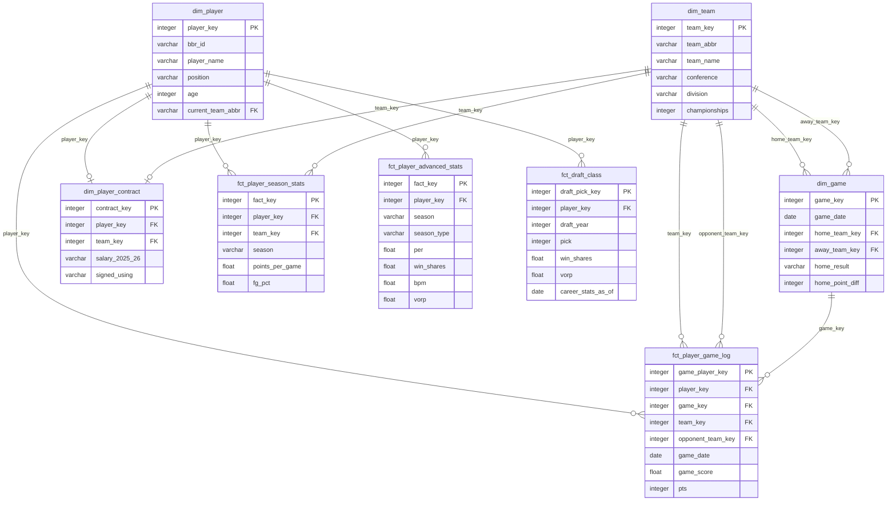

# NBA Analytics — dbt + PostgreSQL Portfolio


End-to-end analytics pipeline that scrapes NBA data from Basketball Reference, loads it into PostgreSQL, and transforms it through a dimensional model using **dbt Core**. The project covers the full data engineering stack: web scraping, data modelling, testing, orchestration, and CI/CD.

### At a glance

| | |
|---|---|
| **Data scraped** | ~733 players · ~15,000 game logs · 2,666 draft picks (40 years) · 556 contracts · 24-team fantasy league |
| **dbt models** | 30+ models across 3 layers (staging · intermediate · marts) + a **fantasy metrics layer** |
| **Data tests** | 90+ tests (schema + business-rule assertions + fantasy guardrails) |
| **Fantasy engine** | 7-cat z-score valuation · FA/draft/cap views · Streamlit GM tool (`dashboard/fantasy_gm_tool.py`) |
| **Orchestration** | Dagster weekly schedule + partitioned scraping by season |
| **CI/CD** | GitHub Actions: `dbt seed → compile → run → test` on every PR |

---

## Architecture

```
Basketball Reference (BBR)
         │
         │  Selenium + selenium-stealth (headless Chromium)
         │  One session reused across pages; restarts every 150 players
         ▼
   src/scraping/          ← Python scripts, one per data domain
         │
         │  pandas → CSV
         ▼
    seeds/ (raw layer)    ← dbt seed loads CSVs into analytics_raw schema
         │
         ▼
  models/staging/bbr/     ← stg_bbr__*.sql — type-cast, rename, filter header rows
         │
         ▼
  models/intermediate/    ← int_*.sql — de-duplicate traded players (TOT/2TM logic)
         │
         ▼
    models/marts/         ← dim_*.sql / fct_*.sql — dimensional model, real PG tables
```

### Schema layout in PostgreSQL

| Schema | Purpose |
|---|---|
| `analytics_raw` | Seed CSVs loaded verbatim by `dbt seed` |
| `analytics_staging` | Cleaned, typed views over the raw seeds |
| `analytics_intermediate` | Business-logic views (de-duplication, joins) |
| `analytics_marts` | Final tables consumed by BI tools or notebooks |

---

## 🏀 Fantasy Decision Engine

Beyond the raw NBA warehouse, the project powers a **real-time decision engine** for a
24-team head-to-head dynasty fantasy league ("Bandeja de 3"). It turns live league data
into actionable calls (trades, free agency, draft) — the kind of "which move is best
right now?" answer a GM needs.

**Pipeline:** a second scraper (`src/scraping/fantasy_gm.py`) pulls the league from the
FantasyGM internal JSON API (Selenium only for login; then `requests`). Seeds feed a dbt
**metrics layer** (`models/marts/fantasy/metrics/`) that exposes real-time views:

| View | What it answers |
|---|---|
| `vw_my_roster_metrics` | My roster's value by category (punt-TOV) |
| `fct_league_category_strength` | Which of the 24 teams wins each category (rival scan) |
| `fct_fa_targets` | Best available free agents, ranked by fit + match rule |
| `fct_draft_board` | Prospects ranked by **talent × opportunity** (NBA landing spot) |
| `fct_team_cap` | Payroll / cap space / open slots per franchise |

The valuation core is a **7-category z-score model** (points, rebounds, assists, stocks,
threes, plus-minus, turnovers-inverted) with a **punt-TOV value** (`z_total − z_tov`) that
matches how category leagues are actually won. Guardrail tests codify real bugs found while
building it (accent-breaking joins, `$`-vs-`$M` unit errors, draft-night-vs-final team).

**GM Tool (prototype):** a Streamlit app for live use during FA and the draft —
`streamlit run dashboard/fantasy_gm_tool.py`. It runs on `dashboard/fantasy_engine.py`
(a reproducible pandas engine that reads the seeds directly, no DB required), with tabs for
My Team · Free Agency · Draft · League · Cap. See `docs/fantasy/metrics_engine/` for the
end-to-end design (absorption → schema → build).

---

## Data Sources

All data comes from **Basketball Reference**. Plain HTTP requests return 403; Selenium drives a headless Chromium instance with `selenium-stealth` patches to bypass bot detection.

| Script | BBR page | Output seed | Notes |
|---|---|---|---|
| `src/scraping/players.py` | Per-game roster | `seeds/players.csv` | Extracts real `bbr_id` per player |
| `src/scraping/stats.py` | Per-game full stats | `seeds/players_stats.csv` | 25 stat columns + season |
| `src/scraping/advanced_stats.py` | Advanced stats — regular + playoffs | `seeds/players_advanced_stats.csv` | `season_type` ∈ {regular, playoffs} |
| `src/scraping/teams.py` | All-time franchise summary | `seeds/team.csv` | |
| `src/scraping/contracts.py` | Current player contracts | `seeds/contracts.csv` | |
| `src/scraping/draft.py` | NBA Draft 1986–2025 | `seeds/draft.csv` | Single session, ~2 min |
| `src/scraping/player_gamelogs.py` | Per-player game logs — GmSc, opponent, result | `seeds/player_gamelogs.csv` | Resume-safe: appends per player, skips scraped |
| `src/scraping/box_scores.py` | Box scores by date (alternative) | `seeds/box_scores.csv` | Incremental by date range |
| _(static)_ | — | `seeds/team_info.csv` | 30-team reference (conference, division) |

### BBR season variable

`BBR_SEASON` in `.env` controls which season is scraped:

```
BBR_SEASON=2026   → scrapes the 2025-26 season
                    season label stored as "2025-26" in all CSVs
```

---

## dbt Models

### Staging layer (`models/staging/bbr/`)

| Model | Source seed | Description |
|---|---|---|
| `stg_bbr__players` | `players` | Roster: name, team, position, age, season |
| `stg_bbr__player_stats` | `players_stats` | 25 per-game stat columns + season |
| `stg_bbr__player_advanced_stats` | `players_advanced_stats` | PER, TS%, WS, BPM, VORP + season + season_type |
| `stg_bbr__teams` | `team` | Franchise history |
| `stg_bbr__contracts` | `contracts` | Salary data by season |
| `stg_bbr__draft` | `draft` | Draft picks with career stats |
| `stg_bbr__player_gamelogs` | `player_gamelogs` | Game log per player — GmSc, opponent, result, decimal minutes |
| `stg_bbr__box_scores` | `box_scores` | Per-player per-game box score (alternative source) |

### Intermediate layer (`models/intermediate/`)

| Model | Purpose |
|---|---|
| `int_players__deduped` | Removes per-team rows for traded players (keeps TOT/2TM/3TM aggregate) |
| `int_player_stats__season_totals` | Same de-duplication applied to stats |
| `int_player_advanced_stats__deduped` | De-duplication per season × season_type |
| `int_games__from_gamelogs` | Derives game-level entities (home/away teams, result, margin) from player logs |

### Marts layer (`models/marts/`)

| Model | Grain | Description |
|---|---|---|
| `dim_player` | 1 per player | Current team, conference, division, 8-digit ID from `bbr_id` |
| `dim_team` | 1 per franchise | All-time best era, conference, 8-digit ID from team abbreviation |
| `dim_game` | 1 per game | Game entity derived from player logs — home/away teams, result, margin |
| `dim_player_contract` | 1 per player | Current contract snapshot — salaries by season, CBA mechanism |
| `fct_player_season_stats` | player × season | Per-game averages, shooting splits |
| `fct_player_advanced_stats` | player × season × season_type | PER, WS, BPM, VORP — regular + playoffs |
| `fct_draft_class` | draft_year × pick | 40 years of draft picks + career outcomes |
| `fct_player_game_log` | player × game | Game log: stats + GmSc + opponent + result |

---

## Layer Design Decisions

### Why three layers?

- **Staging** — Only raw → clean. No business logic. Renaming `FG%` → `fg_pct`, casting strings to integers, filtering BBR's repeated header rows.
- **Intermediate** — Business logic isolated from marts. Primary example: the **traded-player problem** — BBR inserts a `TOT` row for every traded player plus one row per team. Removing duplicates here means every mart gets a guaranteed one-row-per-player view.
- **Marts** — Dimensional tables materialized as real PostgreSQL tables. These are the layer analysts query.

### Traded player handling

```
stg_bbr__player_stats:
  Player A | LAL | 15.2 pts   ← per-team row
  Player A | 2TM | 17.0 pts   ← season aggregate row (BBR 2024-25+)
  Player A | TOT | 17.0 pts   ← legacy format (pre-2024-25)

int_player_stats__season_totals:
  Player A | 2TM | 17.0 pts   ← only the aggregate row survives
```

The regex `^\d+TM$` handles both the new `2TM`/`3TM` format and falls back to `TOT` for historical data.

### Advanced stats: single table with `season_type`

Instead of separate tables for regular season and playoffs, a single `fct_player_advanced_stats` table uses a `season_type` column (`'regular'` | `'playoffs'`). This makes playoff vs. regular season comparisons a single `WHERE` filter rather than a join.

### 8-digit integer IDs

All dimensional tables expose an 8-digit integer ID (`player_key`, `team_key`, etc.) generated by the `generate_id` macro. The macro uses PostgreSQL's `hashtext()` with modular arithmetic to produce values between `10000000` and `99999999`, ensuring stable joins even when player names are corrected or teams relocate.

```sql
-- Example: player_key for "doncilu01"
SELECT 10000000 + (abs(hashtext('doncilu01'))::bigint % 90000000);
-- → always the same 8-digit integer
```

---

## Setup

### Prerequisites

- Python 3.11+
- PostgreSQL 14+ (or Docker Compose — see below)
- Chromium + chromedriver via snap: `sudo snap install chromium`

### Install

```bash
python3 -m venv .venv
source .venv/bin/activate
pip install -r requirements.txt
dbt deps --profiles-dir .dbt   # installs dbt_utils package
```

### Configure credentials

```bash
cp .env.example .env
# Edit .env — default values work for local Docker PostgreSQL
source .env
```

### Start PostgreSQL

**Option A — Docker Compose (recommended):**
```bash
docker compose up -d
```

**Option B — WSL / local PostgreSQL:**
```bash
sudo service postgresql start
sudo -u postgres psql -c "CREATE DATABASE nba;"   # first time only
```

### Quick start — demo reproduzível (sem scraping)

Os seeds de dados reais são gerados pelos scrapers (não versionados). Para ver o
projeto rodando de ponta a ponta a partir de um **clone novo**, sem raspar nada,
use as amostras de demonstração (`ci/sample_seeds/`, as mesmas do CI):

```bash
docker compose up -d postgres          # banco de pé
./scripts/bootstrap_demo.sh            # copia amostras → dbt deps + build + test
streamlit run dashboard/app.py         # painel em http://localhost:8501
```

Para os **dados completos**, rode os scrapers (ver *Data Sources*) — o
`bootstrap_demo.sh` se recusa a sobrescrever seeds reais já presentes.

---

## Running the Pipeline

### 1 — Scrape fresh data

```bash
source .venv/bin/activate
cd src/scraping
python run_all.py
```

This writes all CSVs to `seeds/`. Re-run whenever you want updated stats.

> **Draft note**: `draft.py` scrapes 40 years in a single browser session (~2 minutes). Included in `run_all.py`, runs last.
>
> **Game logs note**: `player_gamelogs.py` is resume-safe — if interrupted, rerunning picks up from the last completed player. Uses incremental per-player CSV writes to avoid data loss on crashes.

### 2 — Scrape box scores (date range)

```bash
cd src/scraping

# Specific date
python box_scores.py --date 2026-04-30

# Date range
python box_scores.py --start 2026-10-01 --end 2026-04-30

# Yesterday (default — good for daily cron)
python box_scores.py
```

New dates are appended; already-stored `game_id`s are never duplicated.

### 3 — Load and transform with dbt

```bash
source .venv/bin/activate

dbt seed --profiles-dir .dbt        # Load CSVs into analytics_raw
dbt run  --profiles-dir .dbt        # Build all views and tables
dbt test --profiles-dir .dbt        # Run 90 data quality tests
```

### Run a specific model

```bash
dbt run --profiles-dir .dbt --select stg_bbr__draft
dbt run --profiles-dir .dbt --select fct_player_advanced_stats+
```

### 4 — Orchestration with Dagster (optional)

```bash
source .venv/bin/activate
dbt compile --profiles-dir .dbt       # generates manifest.json required by Dagster
dagster dev -f orchestration/definitions.py
# UI at http://localhost:3000
```

The `nba_pipeline` job runs all scrapers then the full dbt build. Scheduled every Monday at 06:00. Each scraper accepts `--season YYYY-YY` from the Dagster partition key.

---

## Project Structure

```
├── seeds/                          # Raw CSV seeds (dbt raw layer)
│   ├── players.csv
│   ├── players_stats.csv
│   ├── players_advanced_stats.csv  # regular + playoffs, with season_type
│   ├── draft.csv                   # 40 years of draft picks
│   ├── player_gamelogs.csv         # per-player per-game logs (resume-safe scraper)
│   ├── box_scores.csv              # per-game player stats (incremental by date)
│   ├── team.csv
│   ├── team_info.csv               # Static 30-team reference
│   └── schema.yml
│
├── models/
│   ├── staging/bbr/                # stg_bbr__*.sql
│   ├── intermediate/               # int_*.sql — de-duplication and join logic
│   └── marts/
│       ├── dimensions/             # dim_player.sql, dim_team.sql, dim_game.sql, dim_player_contract.sql
│       └── facts/                  # fct_*.sql — queryable fact tables
│
├── macros/
│   └── generate_id.sql             # 8-digit integer ID via hashtext() + modular arithmetic
│
├── tests/                          # Singular dbt tests (business-rule assertions)
│   ├── assert_pts_non_negative.sql
│   ├── assert_minutes_valid.sql
│   └── assert_win_shares_reasonable.sql
│
├── snapshots/                      # SCD Type 2 snapshots
│   ├── player_contract_snapshot.sql
│   └── player_roster_snapshot.sql
│
├── src/scraping/
│   ├── common/
│   │   ├── browser.py              # Selenium/Chromium setup + selenium-stealth patches
│   │   └── parsing.py              # BBR comment-table unescaping
│   ├── players.py
│   ├── stats.py
│   ├── advanced_stats.py           # Regular + playoff advanced stats
│   ├── teams.py
│   ├── contracts.py
│   ├── draft.py                    # 40-year draft history, single session
│   ├── player_gamelogs.py          # Per-player logs, incremental + crash-recovery
│   ├── box_scores.py               # Per-game stats, incremental by date
│   └── run_all.py
│
├── orchestration/
│   ├── assets.py                   # Dagster assets (scraping + dbt)
│   └── definitions.py              # Dagster Definitions entry point
│
├── .github/workflows/
│   ├── ci.yml                      # PR validation: dbt compile + seed + run + test
│   └── docs.yml                    # Push to master: dbt docs → GitHub Pages
│
├── docker-compose.yml              # PostgreSQL 17-alpine + healthcheck
├── dbt_project.yml
├── .env.example                    # Credential template
├── profiles.yml.example            # dbt profiles template
└── requirements.txt
```

---

## Data Model



---

## Example Queries

### Top 10 players by average Game Score (road wins, ≥20 min)

```sql
SELECT
    p.player_name,
    p.current_team_abbr,
    round(avg(g.game_score)::numeric, 1) AS avg_gms,
    count(*)                             AS games
FROM analytics_marts.fct_player_game_log g
JOIN analytics_marts.dim_player p USING (player_key)
WHERE g.result     = 'W'
  AND g.home_away  = 'away'
  AND g.minutes_played >= 20
GROUP BY 1, 2
ORDER BY 3 DESC
LIMIT 10;
```

### Regular season vs. playoffs — PER and BPM (current season)

```sql
SELECT
    p.player_name,
    max(CASE WHEN a.season_type = 'regular'  THEN a.per  END) AS per_regular,
    max(CASE WHEN a.season_type = 'playoffs' THEN a.per  END) AS per_playoffs,
    max(CASE WHEN a.season_type = 'regular'  THEN a.bpm  END) AS bpm_regular,
    max(CASE WHEN a.season_type = 'playoffs' THEN a.bpm  END) AS bpm_playoffs
FROM analytics_marts.fct_player_advanced_stats a
JOIN analytics_marts.dim_player p USING (player_key)
WHERE a.season = '2025-26'
GROUP BY 1
HAVING max(CASE WHEN a.season_type = 'playoffs' THEN 1 ELSE 0 END) = 1
ORDER BY per_playoffs DESC NULLS LAST
LIMIT 15;
```

### Contract efficiency — Win Shares per million dollars

```sql
SELECT
    p.player_name,
    p.current_team_abbr,
    replace(replace(c.salary_2025_26, '$', ''), ',', '')::bigint / 1e6 AS salary_m,
    a.win_shares,
    round(
        (a.win_shares / nullif(replace(replace(c.salary_2025_26,'$',''),',','')::numeric, 0) * 1e6)::numeric,
        2
    ) AS ws_per_million
FROM analytics_marts.dim_player_contract c
JOIN analytics_marts.dim_player           p USING (player_key)
JOIN analytics_marts.fct_player_advanced_stats a ON a.player_key = p.player_key
                                                 AND a.season = '2025-26'
                                                 AND a.season_type = 'regular'
WHERE c.salary_2025_26 IS NOT NULL
ORDER BY ws_per_million DESC NULLS LAST
LIMIT 20;
```

### Draft class hit rate by round (≥3 seasons played)

```sql
SELECT
    draft_year,
    round AS draft_round,
    count(*)                                        AS total_picks,
    sum(reached_3_seasons::int)                     AS hits,
    round(avg(reached_3_seasons::int) * 100, 1)     AS hit_rate_pct,
    round(avg(COALESCE(win_shares, 0))::numeric, 1) AS avg_career_ws
FROM analytics_marts.fct_draft_class
GROUP BY 1, 2
ORDER BY 1 DESC, 2;
```

### Closest games of the season (smallest winning margin)

```sql
SELECT
    g.game_date,
    home.team_abbr  AS home_team,
    away.team_abbr  AS away_team,
    g.home_result,
    abs(g.home_point_diff) AS margin
FROM analytics_marts.dim_game g
JOIN analytics_marts.dim_team home ON g.home_team_key = home.team_key
JOIN analytics_marts.dim_team away ON g.away_team_key = away.team_key
WHERE g.home_point_diff IS NOT NULL
ORDER BY margin ASC
LIMIT 10;
```

---

## Design Decisions and Trade-offs

**Selenium + selenium-stealth over requests/httpx** — BBR returns 403 for non-browser user agents and serves Cloudflare challenge pages for headless browsers. `selenium-stealth` patches `navigator.webdriver`, the GPU fingerprint, and automation flags. A single `build_driver()` instance is reused across all pages in multi-page scrapers to amortize the ~8-second startup cost.

**Resume-safe game log scraper** — Scraping ~580 players takes 30–60 minutes and Chrome tabs can crash mid-run. The scraper writes each player's data immediately to CSV and tracks which `bbr_id`s are already done. Rerunning resumes automatically from the last checkpoint.

**Single browser session for draft scraper** — Scraping 40 draft year pages with separate sessions costs ~20s startup overhead each (800+ seconds total). A single session with 3s navigation sleep completes in ~2 minutes.

**Box scores as CSV seeds (current season) vs direct PostgreSQL (historical)** — A single season is ~25,000 rows (manageable CSV). Forty seasons would be ~1,000,000 rows — at that scale `dbt seed` is impractical and direct PostgreSQL writes with `materialized: incremental` are the right path.

**Single `fct_player_advanced_stats` table** — Regular season and playoff advanced stats share identical columns. A `season_type` column (instead of two separate tables) keeps model count low and makes season-type comparisons trivially easy.

**dbt Core over raw SQL scripts** — Dependency resolution (`ref()`), automated test execution, and schema documentation from the first layer. Lineage tracking and 90 automated data tests justify the overhead for a multi-model pipeline.

**PostgreSQL over DuckDB** — DuckDB would be simpler locally. PostgreSQL demonstrates a production-grade setup: schema separation, standard SQL compatibility, and compatibility with BI tools (Metabase, Superset, Evidence).

**Seeds over an ELT tool** — BBR data is scraped to CSV, not streamed. `dbt seed` keeps ingestion inside the dbt DAG so tests and documentation apply from the first layer.

---

## Roadmap

### Near-term (ready to implement)

| Feature | Notes |
|---|---|
| Multi-season historical stats | Run scrapers with multiple `BBR_SEASON` values; `season` column already in place |
| `fct_player_career_stats` | Aggregate WS/VORP/BPM across seasons from `fct_player_advanced_stats` |
| Box scores — full season | `python box_scores.py --start 2025-10-01 --end 2026-06-30` |
| Streamlit / Evidence dashboard | Connect directly to `analytics_marts` schema |

### Medium-term (needs design)

| Feature | Notes |
|---|---|
| Incremental dbt models for box scores | Replace seed approach with `materialized: incremental` + date watermark |
| Historical box scores (40 years) | ~49,200 game pages; direct PostgreSQL writes required; ~40–60h scrape time |
| Player similarity clustering | k-means on PER/TS%/BPM/VORP in a Jupyter notebook |
| Draft value model | Predict career WS from pick number + college via logistic regression |

### Long-term

| Feature | Notes |
|---|---|
| NBA Stats API integration | Official API: fewer restrictions, richer play-by-play data |
| Shot chart data | x/y coordinates not on BBR — NBA Stats API or Second Spectrum |
| Real-time game updates | Webhook or streaming ingestion during live games |
| dbt Semantic Layer | Define metrics (PPG, WS/48) once; consume in any BI tool via dbt Cloud |
