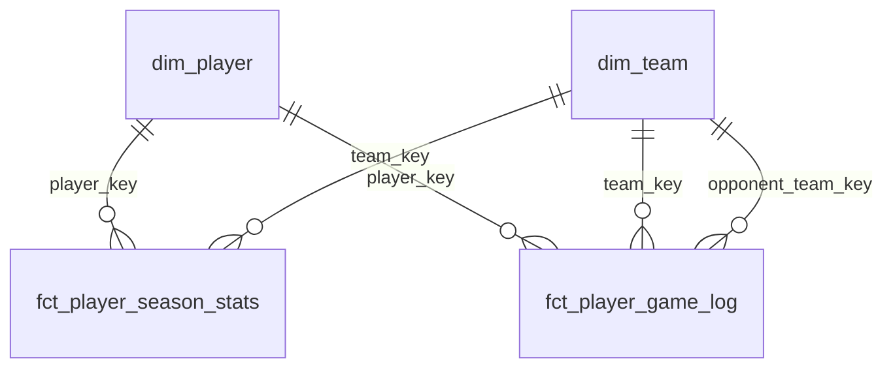

# Auditoria Técnica — NBA Analytics Pipeline

> Revisão como Engenheiro de Dados Sênior. Cada item tem severidade:
> 🔴 **Bloqueante** — quebra produção ou análises incorretas
> 🟡 **Importante** — risco latente ou dívida técnica relevante
> 🟢 **Melhoria** — boa prática ausente, não quebra nada hoje
>
> **Status de implementação** — itens marcados com ✅ no resumo de prioridades foram resolvidos.
> Ver `docs/desafios_e_solucoes.md` para detalhes de cada correção.

---

## 1. Grão de cada tabela

| Modelo | Grão declarado | Grão real | Problema |
|---|---|---|---|
| `dim_player` | 1 por jogador | 1 por jogador **da temporada atual** | Jogadores cortados durante a temporada somem |
| `dim_team` | 1 por franquia | 1 por franquia **ativa hoje** | Times extintos (SEA, NJN) não existem |
| `fct_player_season_stats` | jogador × temporada | jogador × temporada | ✓ |
| `fct_player_advanced_stats` | jogador × temporada × season_type | jogador × temporada × season_type | ✓ |
| `fct_player_game_log` | jogador × jogo | jogador × jogo | ✓ mas veja item 2 |
| `fct_draft_class` | draft_year × pick | draft_year × pick **+ carreira acumulada** | 🟡 Mistura de grão — pick é estático; carreira muda todo ano |
| `fct_player_contract` | jogador (snapshot) | jogador (snapshot) | 🟡 Não é um fato — é dimensão lenta (SCD2 adequado) |

### 🟡 Mistura de grão em `fct_draft_class`

`draft_year` e `pick` nunca mudam. `win_shares`, `bpm`, `vorp` de carreira mudam a cada temporada. Ao re-rodar o scraper em 2026, as stats de carreira do pick #1 de 1990 serão sobrescritas sem histórico. A separação correta seria:

```
fct_draft_class        → grain: draft_year × pick  (imutável — metadados da escolha)
fct_draft_career_stats → grain: draft_year × pick × season_scraped  (carreira acumulada)
```

### 🟡 `fct_player_contract` é uma dimensão, não um fato

Não tem medidas de evento — é um snapshot de estado atual. O nome correto seria `dim_player_contract` ou, melhor, um dbt snapshot (`snapshots/player_contract.sql`) para capturar mudanças de salário ao longo do tempo.

---

## 2. Entidade `game` ausente

🔴 **Não existe `dim_game` nem `fct_game` no modelo.**

Atributos de jogo estão acoplados ao `fct_player_game_log`, repetidos para cada jogador:

| Atributo | Repetido por | Deveria estar em |
|---|---|---|
| `game_date` | ~12 jogadores × 2 times = ~24 linhas | `dim_game` |
| `result` (W/L) | ~12 linhas por time | `dim_game` |
| `point_diff` | ~24 linhas | `dim_game` |
| `home_away` | ~24 linhas | `dim_game` |
| `opponent_abbr` | ~12 linhas | `dim_game` |
| `game_year` | ~24 linhas | `dim_game` |

**Impacto real:** uma query `COUNT(DISTINCT game_date)` conta dias, não jogos. Se dois times jogaram no mesmo dia, você não tem `game_id` confiável para distingui-los no modelo atual (o game log não produz `game_id` — vem da URL do box score, não do game log individual).

**O que deveria existir:**

```sql
-- dim_game (grain: 1 por jogo)
game_key         VARCHAR  PK
game_date        DATE
home_team_key    FK → dim_team
away_team_key    FK → dim_team
home_score       INTEGER
away_score       INTEGER
season           VARCHAR
season_type      VARCHAR  -- regular | playoffs
-- futuro: venue, arena_timezone, tv_broadcast, attendance
```

```sql
-- fct_player_game_log (com dim_game)
game_player_key  PK
game_key         FK → dim_game   ← chave de contexto do jogo
player_key       FK → dim_player
team_key         FK → dim_team
-- apenas stats do jogador; context do jogo via join
```

---

## 3. Revisão de chaves

### 🔴 Chave natural do provedor ignorada como PK

`dim_player.player_key = MD5(player_name)`. O `player_name` muda:
- BBR corrigiu "Mo Bamba" → "Mohamed Bamba" em 2023
- Nomes com acento variam entre temporadas (Nikola Jokić × Nikola Jokic)
- Isso quebra FKs silenciosamente — `fct_player_game_log` passa a ter `player_key = NULL` em todos os registros do jogador renomeado

`bbr_id` (`jamesle01`) é o identificador estável do provedor e NUNCA muda. Ele deveria ser o natural key declarado como `surrogate_key` base:

```sql
-- Correto: chave baseada no identificador estável do provedor
{{ generate_surrogate_key(['p.bbr_id']) }} as player_key
```

Hoje o `bbr_id` está em `dim_player` como coluna extra mas não é a base da surrogate key.

### 🟡 `fct_player_game_log` PK inclui `team_abbr` desnecessariamente

`MD5(bbr_id, game_date, team_abbr)` — um jogador não pode jogar por dois times no mesmo dia. O `team_abbr` na chave é redundante e cria risco: se o BBR corrigir a abreviação do time, o mesmo jogo ganha uma nova PK.

PK correto: `MD5(bbr_id, game_date)`.

### 🟡 Sem `unique_key` em modelos incrementais

Não existe nenhum modelo `materialized: incremental` no projeto. O `box_scores.py` deduplica no Python antes de salvar CSV, mas o modelo dbt correspondente é `materialized: view` sobre o seed — qualquer `dbt seed` completo sobrescreve tudo.

### 🟡 FK sem enforcement no banco

Os testes `relationships:` no YAML **validam** FKs mas não as **criam** no PostgreSQL. Se um jogador existir em `fct_player_game_log` mas não em `dim_player`, o dbt avisa no `dbt test` mas não bloqueia o insert. Para produção, as constraints DDL precisariam existir separadamente.

### 🟢 Surrogate key com MD5 em vez de `dbt_utils`

O macro customizado `generate_surrogate_key` usa `MD5` diretamente. O pacote `dbt_utils` oferece `generate_surrogate_key()` com tratamento de NULL, coerção de tipo e portabilidade entre bancos. Vale trocar.

---

## 4. Histórico / SCD

### 🔴 Nenhum snapshot dbt implementado

O diretório `snapshots/` existe mas está vazio. Sem snapshots:

| Tabela | O que se perde |
|---|---|
| `dim_player` | Quando um jogador foi trocado, cortado ou aposentou — só existe o estado atual |
| `dim_team` | Mudanças de coach, arena, divisão |
| `fct_player_contract` | Histórico de renegociações, buyouts, opções exercidas |
| Seeds (`players.csv`) | Cada `dbt seed` sobrescreve — zero histórico da temporada toda |

**Mínimo viável para portfolio:**

```sql
-- snapshots/player_contract_snapshot.sql

{{
    config(
        target_schema='snapshots',
        unique_key='player_name',
        strategy='check',
        check_cols=['salary_2025_26', 'team_abbr', 'signed_using'],
    )
}}
select * from {{ ref('stg_bbr__contracts') }}

```

### 🟡 `dim_player` é current-state only, sem SCD

Um jogador cortado em dezembro desaparece do `dim_player` quando o scraper roda em março. Qualquer `fct_player_game_log` de dezembro passa a ter `player_key = NULL`. Para análises históricas isso é incorreto.

Solução: ou manter `dim_player` como SCD Type 1 (aceitar que é snapshot atual) e deixar isso **documentado**, ou implementar SCD Type 2 com dbt snapshot.

### 🟡 `team_info` é seed estático sem versionamento

Se o Thunder muda de divisão ou uma expansão cria o 31º time, o CSV é editado manualmente e o histórico some. Para um portfolio, tudo bem documentado — mas deve constar como limitação no README.

---

## 5. Timezone

### 🟡 Zero tratamento de timezone em todo o pipeline

- Datas armazenadas como `DATE` — sem componente de hora
- BBR não publica horário dos jogos nas páginas scrapeadas (só data)
- Sem `scheduled_at_utc`, `arena_timezone`, nem `league_day`

**Por que importa na prática:**

Um jogo em Los Angeles que começa às 22:30 PT (01:30 ET do dia seguinte) aparece na BBR com a data de Los Angeles. Se você cruzar com dados de outra fonte usando datas ET, os jogos do pacífico vão parecer um dia "no futuro".

**O que implementar:**

```sql
-- dim_game (futuro)
game_date_local     DATE        -- data no fuso do venue
game_date_et        DATE        -- data em ET (referência da liga)
tipoff_utc          TIMESTAMPTZ -- horário exato em UTC
arena_timezone      VARCHAR     -- 'America/Los_Angeles', 'America/New_York'...
```

**League day:** a NBA define o "dia" da liga em Eastern Time. Jogos que começam às 00:30 ET pertencem ao dia anterior para efeitos de standings e stats. Sem `tipoff_utc`, não é possível computar isso.

---

## 6. Lifecycle esportivo

### 🟡 Pipeline assume que todos os jogos estão `complete`

Não existe nenhum campo `game_status` em qualquer tabela. O scraper (`box_scores.py`) simplesmente pula URLs sem tabela, mas não distingue:

| Status | Tratamento atual | Correto |
|---|---|---|
| `complete` | scrapa normalmente | scrapa + armazena |
| `inprogress` | scrapa stats parciais sem saber | não deve scraper até `closed` |
| `postponed` | pula silenciosamente | armazena `game_id` com status |
| `cancelled` | pula silenciosamente | armazena com status |
| `scheduled` | não existe no pipeline | dim_game alimentada pelo schedule |
| `time-tbd` | não existe | dim_game com data mas sem hora |

**Risco concreto:** se o scraper rodar durante um jogo, salva stats parciais no CSV. Na próxima run (se o `game_id` já existir), o dedup do `box_scores.py` IMPEDE a atualização com os dados completos.

---

## 7. Correções tardias

### 🔴 Sem mecanismo de lookback ou change log

O `box_scores.py` usa dedup por `game_id`:

```python
# box_scores.py
if existing_ids & new_ids:
    df = df[~df["game_id"].isin(overlap)]  # descarta se já existe
```

Isso significa que **uma correção da BBR em um jogo já armazenado nunca será aplicada**. BBR corrige box scores por várias razões:
- Atribuição errada de rebote/assist/steal
- Falta técnica adicionada retroativamente
- Mudança de placar após protesto

**O que implementar:**

```python
# Substituição correta: UPSERT em vez de skip
combined = pd.concat([existing, new_rows])
combined = combined.drop_duplicates(subset=["game_id", "player_name"], keep="last")
```

Para dbt incremental, o correto é:

```sql
-- materialized: incremental com unique_key
{{ config(
    materialized='incremental',
    unique_key=['game_id', 'bbr_id'],
    on_schema_change='sync_all_columns'
) }}
-- lookback window de 3 dias para capturar correções

where game_date >= (select max(game_date) - interval '3 days' from {{ this }})

```

### 🟡 Sem sensor de anomalia pós-scraping

Não existe checagem de: "esse jogo foi scrapeado antes com N linhas; agora voltou com N-3 linhas — algo mudou". Isso só é detectável com um `AssetObservation` no Dagster ou um teste dbt customizado.

---

## 8. dbt — diagnóstico detalhado

### Naming ✓
Convenção `stg_bbr__*`, `int_*__*`, `dim_*`, `fct_*` aplicada consistentemente.

### Materializations ✓
`view → view → table` correto para o volume atual.

### 🔴 Snapshots ausentes
Diretório existe, zero arquivos. Ver item 4.

### 🟡 Testes inconsistentes entre modelos

| Modelo | `unique` | `not_null` | `relationships` |
|---|---|---|---|
| `dim_player` | ✓ player_key, player_name, bbr_id | ✓ | ✓ current_team_abbr |
| `dim_team` | ✓ team_key, team_abbr | ✓ | — |
| `fct_player_season_stats` | ✓ fact_key | ✓ | ✓ player_key |
| `fct_player_advanced_stats` | ✓ fact_key | ✓ | ✓ player_key |
| `fct_player_game_log` | ✓ game_player_key | ✓ bbr_id | ✓ player_key (sem opponent_team_key) |
| `fct_draft_class` | ✓ draft_pick_key | ✓ draft_year, pick, player_name | ✗ player_key sem relationships |
| `fct_player_contract` | ✓ contract_key | ✓ player_name | ✓ player_key |

`fct_draft_class.player_key` não tem teste `relationships` — sem ele, `player_key` preenchido com valor inválido passaria despercebido.

### 🟡 dbt Contracts (`enforce_contract`) não usado

dbt Core 1.5+ suporta contratos de coluna:

```yaml
models:
  - name: dim_player
    config:
      contract:
        enforced: true
    columns:
      - name: player_key
        data_type: varchar
```

Isso garante que uma mudança de tipo em `dim_player` quebra o build antes de chegar ao warehouse. Sem isso, uma mudança de `VARCHAR` para `INTEGER` em `player_key` só aparece como erro em downstream às 06:00 de segunda-feira.

### 🟡 Source freshness não configurado

`_bbr__sources.yml` não tem bloco `freshness:`. Sem isso, `dbt source freshness` não funciona e não há SLA monitorado:

```yaml
sources:
  - name: analytics_raw
    freshness:
      warn_after: {count: 8, period: day}
      error_after: {count: 14, period: day}
    loaded_at_field: _dbt_loaded_at  # precisaria de coluna de timestamp
```

### 🟢 Exposures ausentes

Não existe nenhum arquivo `exposures:` declarando quem consome as marts. Para portfolio, expor pelo menos uma análise de Jupyter:

```yaml
exposures:
  - name: draft_analysis_notebook
    type: analysis
    owner:
      name: Henri
    depends_on:
      - ref('fct_draft_class')
      - ref('dim_player')
```

### 🟢 `dbt_utils` não instalado

O macro customizado `generate_surrogate_key` refaz algo que `dbt_utils` já faz com mais robustez. Vale adicionar ao `packages.yml`:

```yaml
packages:
  - package: dbt-labs/dbt_utils
    version: [">=1.0.0", "<2.0.0"]
```

### CI ✓ (com ressalvas)

`ci.yml` roda `compile → seed → run → test` em PR. Bom.

Ressalvas:
- Trigger só em `models/**`, `seeds/**`, `macros/**` — mudanças em `orchestration/` não trigam CI
- Não roda `dbt source freshness`
- Não publica resultados de teste como comment no PR

---

## 9. Dagster — diagnóstico detalhado

### Assets-first ✓
Uso correto de `@asset` + `@dbt_assets`. Sem ops soltos.

### Schedule ✓
`nba_weekly_monday` declarado e registrado em `Definitions`.

### 🔴 Sem retries em nenhum asset

Selenium falha por rate-limit, timeout de rede, ou mudança de HTML do BBR. Sem retry, uma falha em `scrape_players` cancela todo o pipeline:

```python
from dagster import RetryPolicy, Backoff

@asset(
    retry_policy=RetryPolicy(
        max_retries=3,
        delay=60,           # 60s entre tentativas
        backoff=Backoff.EXPONENTIAL,
    )
)
def scrape_players(context): ...
```

### 🔴 Sem sensors

O pipeline só roda por schedule (segundas às 06:00). Se o scraper falhar e produzir um CSV vazio/corrompido, o `dbt seed` da semana seguinte carregará dados ruins sem que ninguém saiba.

Sensor mínimo necessário: verificar que os CSVs em `seeds/` têm mais de N linhas antes de iniciar o dbt:

```python
@sensor(job=nba_pipeline_job)
def seed_file_sensor(context):
    players_path = PROJECT_DIR / "seeds/players.csv"
    if players_path.stat().st_size < 10_000:  # menos de ~10KB = provável scraping falhou
        return SkipReason("players.csv parece vazio ou corrompido")
    yield RunRequest(run_key=str(players_path.stat().st_mtime))
```

### 🟡 Sem particionamento

Nenhum asset tem `partitions_def`. Isso significa:
- Backfill de dados históricos = rodar o script manualmente e rezar
- Não dá pra re-rodar só "semana de 12 a 18 de fevereiro" — é tudo ou nada

Para `scrape_player_gamelogs` e `scrape_draft`, particionamento por `SEASON` seria o correto:

```python
from dagster import StaticPartitionsDefinition

season_partitions = StaticPartitionsDefinition(
    ["2022-23", "2023-24", "2024-25", "2025-26"]
)

@asset(partitions_def=season_partitions)
def scrape_player_gamelogs(context):
    season = context.partition_key  # ex: "2025-26"
    ...
```

### 🟡 Sem métricas ou alertas

Nenhum asset emite `AssetObservation` ou `MetadataValue`. Não dá pra ver no Dagster UI quantas linhas foram scrapeadas, qual foi o tempo de execução ou se o número de jogadores caiu em relação à semana anterior:

```python
context.add_output_metadata({
    "num_players": MetadataValue.int(len(df)),
    "preview": MetadataValue.md(df.head(5).to_markdown()),
})
```

### 🟡 Concorrência não controlada

`scrape_players`, `scrape_stats`, `scrape_advanced_stats`, `scrape_teams`, `scrape_contracts` não têm dependência entre si e podem rodar em paralelo no Dagster. O risco é abrir 5 sessões de Chrome simultâneas — BBR provavelmente rate-limita e todas falham.

Adicionar `concurrency_limit` no job:

```python
nba_pipeline_job = define_asset_job(
    name="nba_pipeline",
    config={"execution": {"config": {"multiprocess": {"max_concurrent": 1}}}},
    ...
)
```

---

## 10. Usabilidade do portfolio

### README ✓
Estruturado, com setup, comandos e trade-offs.

### 🟡 Sem diagrama visual

O único "diagrama" é ASCII no README e no `modelo_de_dados.md`. Recrutadores e engenheiros sênior esperam um diagrama clicável. Opções:

```markdown
<!-- README.md -->
[](docs/lineage.png)
```

Gerar com `dbt docs generate` + screenshot do lineage graph, ou um diagrama Mermaid no README:



### 🟡 Sem exemplos de consulta

O README descreve o que cada tabela contém, mas não mostra como usá-la. Para portfolio, 3–4 queries de exemplo demonstram que você entende o modelo que construiu:

```sql
-- Top 10 jogadores por Game Score médio em vitórias fora de casa
SELECT player_name, round(avg(game_score), 1) as avg_gms
FROM analytics_marts.fct_player_game_log
WHERE result = 'W' AND home_away = 'away' AND minutes_played >= 20
GROUP BY 1 ORDER BY 2 DESC LIMIT 10;
```

### 🟢 Sem runbook de troubleshooting

O README não tem seção "o que fazer quando X falha". Para portfolio de engenharia, isso demonstra maturidade operacional. Exemplos:

- Chromedriver incompatível com versão do Chromium → como resolver
- `dbt seed` falha com "column type mismatch" → causa e fix
- Dagster UI não abre → verificar `DAGSTER_HOME` e se o manifest existe

---

## Resumo de prioridades

| Prioridade | Item | Ação | Status |
|---|---|---|---|
| 🔴 1 | Chave instável em `dim_player` | Mudar base da surrogate key para `bbr_id` | ✅ `generate_id(['bbr_id'])` — ID 8 dígitos |
| 🔴 2 | `game` como entidade ausente | Criar `dim_game` quando box scores estiverem ativos | ✅ `dim_game` criado via `int_games__from_gamelogs` |
| 🔴 3 | Sem retries no Dagster | Adicionar `RetryPolicy` em todos os assets de scraping | Pendente |
| 🔴 4 | Dedup de `game_id` impede correções | Mudar para UPSERT por `(game_id, bbr_id)` | Pendente |
| 🟡 5 | Sem snapshots | Implementar ao menos `player_contract_snapshot` | ✅ `player_contract_snapshot` + `player_roster_snapshot` criados |
| 🟡 6 | `fct_player_contract` é dimensão | Renomear e mover para `dim_player_contract` ou snapshot | ✅ Renomeado para `dim_player_contract` |
| 🟡 7 | Mistura de grão em `fct_draft_class` | Separar pick metadata de career stats | Pendente |
| 🟡 8 | Sem particionamento no Dagster | Definir `StaticPartitionsDefinition` por season | ✅ Particionamento por temporada + argparse `--season` em todos os scrapers |
| 🟡 9 | Sem métricas/alertas no Dagster | Adicionar `add_output_metadata` nos assets | Pendente |
| 🟡 10 | Testes de FK incompletos | Adicionar `relationships` em `fct_draft_class.player_key` | Pendente |
| 🟢 11 | Diagrama visual | Mermaid ER no README | ✅ Diagrama Mermaid completo no README |
| 🟢 12 | Exemplos de consulta | 4–5 queries no README | ✅ 5 queries analíticas no README |
| 🟢 13 | `dbt_utils` package | Substituir macro customizado | ✅ `generate_surrogate_key` removido; `dbt_utils` instalado |
| 🟢 14 | `enforce_contract` no dbt | Ativar em `dim_player` e `dim_team` | ✅ Contratos ativos em todas as dimensões |
| 🟢 15 | Exposures no dbt | Declarar consumidores das marts | ✅ 3 exposures declarados |
